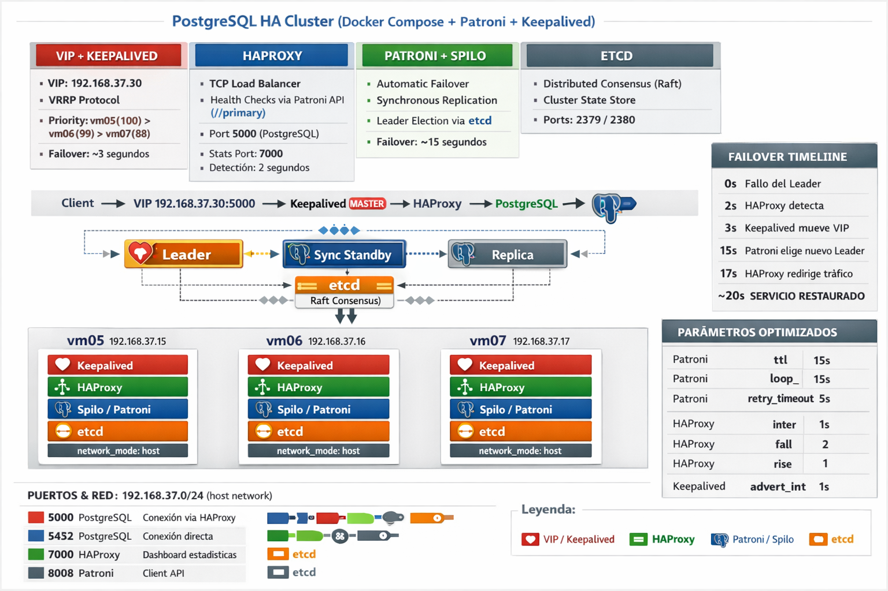

# PostgreSQL HA Stack



Cluster PostgreSQL de alta disponibilidad desplegado con Ansible y Docker Compose.

## Arquitectura

- **Spilo/Patroni**: PostgreSQL 16 con failover automatico
- **etcd**: Consenso distribuido (Raft)
- **HAProxy**: Balanceador TCP con health checks
- **Keepalived**: VIP flotante via VRRP
- **network_mode: host**: Sin overhead de red

```
                    ┌─────────────────────┐
                    │   VIP: 192.168.37.30│
                    │   (Keepalived)      │
                    └──────────┬──────────┘
                               │
           ┌───────────────────┼───────────────────┐
           │                   │                   │
           ▼                   ▼                   ▼
    ┌─────────────┐     ┌─────────────┐     ┌─────────────┐
    │    vm05     │     │    vm06     │     │    vm07     │
    │ Keepalived  │     │ Keepalived  │     │ Keepalived  │
    │ HAProxy     │     │ HAProxy     │     │ HAProxy     │
    │ Spilo       │     │ Spilo       │     │ Spilo       │
    │ etcd        │     │ etcd        │     │ etcd        │
    └─────────────┘     └─────────────┘     └─────────────┘
   network_mode:host   network_mode:host   network_mode:host
```

### Tiempos de Failover

| Componente | Tiempo | Parametros |
|------------|--------|------------|
| HAProxy | ~2s | inter=1s, fall=2 |
| Keepalived | ~3s | advert_int=1s |
| Patroni | ~15s | ttl=15, loop=5 |
| **Total** | **~20s** | |

## Prerequisitos

- Ansible 2.10+
- Docker y Docker Compose en los nodos
- SSH acceso a los nodos como `debian`

## Despliegue

```bash
# Desplegar cluster
ansible-playbook playbooks/deploy.yml

# Verificar salud
ansible-playbook playbooks/health-check.yml

# Generar scripts de administración
ansible-playbook playbooks/generate-scripts.yml
```

## Conexión

```bash
# Via VIP (recomendado)
PGPASSWORD=cjtz8CHhVxF70hbTjpBu psql -h 192.168.37.30 -p 5000 -U postgres

# HAProxy Stats
http://192.168.37.30:7000
```

## Scripts de Administración

Después de ejecutar `generate-scripts.yml`:

```bash
cd scripts/

# Suite de tests
./TestCluster.sh              # Modo interactivo
./TestCluster.sh --stress 5   # 5 iteraciones de stress

# Cambiar líder
./SwitchLeader.sh --status    # Ver estado
./SwitchLeader.sh --to vm06   # Promover vm06

# Generar tráfico de prueba
./TrafficGenerator.sh --retry  # Con reintentos idempotentes

# Destruir cluster (cuidado!)
./DestroyCluster.sh
```

## Estructura

```
postgres-stack/
├── ansible.cfg
├── inventory/hosts.yml              # Nodos del cluster
├── group_vars/postgres_cluster.yml  # Variables globales
├── playbooks/
│   ├── deploy.yml                   # Despliegue principal
│   ├── health-check.yml             # Verificacion de salud
│   └── generate-scripts.yml         # Genera scripts admin
├── templates/                       # Templates Jinja2
├── scripts/                         # Scripts generados (gitignore)
├── reports/                         # Documentacion tecnica
├── images/                          # Diagramas de arquitectura
├── prompts/                         # Prompts para ChatGPT
└── docker-compose.standalone.yml    # Version standalone
```

## Configuración

### Variables principales (group_vars/postgres_cluster.yml)

| Variable | Valor | Descripción |
|----------|-------|-------------|
| `vip` | 192.168.37.30 | IP virtual |
| `haproxy_port` | 5000 | Puerto PostgreSQL |
| `haproxy_stats_port` | 7000 | Puerto HAProxy stats |
| `cluster_name` | postgres-cluster | Nombre del scope Patroni |

### Nodos (inventory/hosts.yml)

| Nodo | IP | Prioridad | Rol inicial |
|------|-----|-----------|-------------|
| vm05 | 192.168.37.15 | 100 | MASTER |
| vm06 | 192.168.37.16 | 99 | BACKUP |
| vm07 | 192.168.37.17 | 98 | BACKUP |

## Documentacion

Ver `reports/` para documentacion detallada:
- `FAILOVER_OPTIMIZATION.md` - Optimizacion de tiempos de failover
- `ANSIBLE.md` - Guia de Ansible
- `TEST_PLAN.md` - Plan de pruebas
- `IDEMPOTENCIA.md` - Patrones de idempotencia

## Notas

- Todos los contenedores usan `network_mode: host` para minimo overhead
- Replicacion sincrona habilitada (zero data loss)
- El directorio `scripts/` esta en `.gitignore`
- Ver `reports/FAILOVER_OPTIMIZATION.md` para ajustar tiempos
